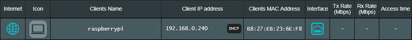
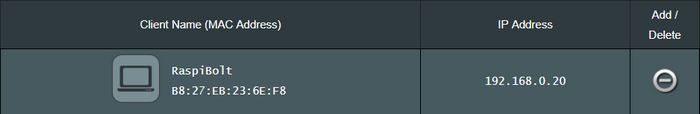
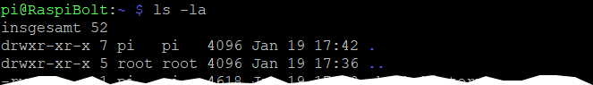
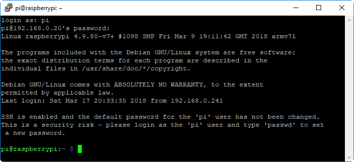
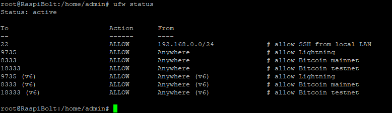
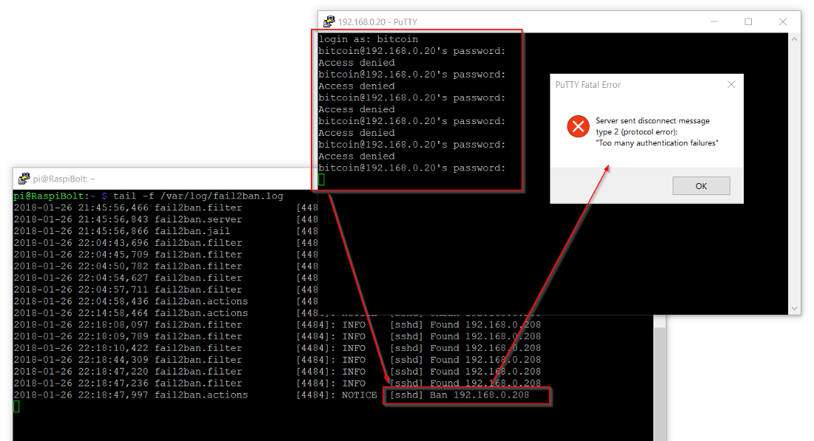
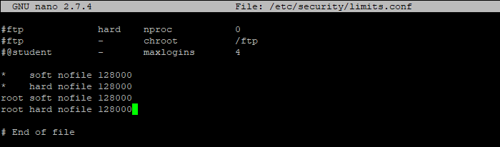
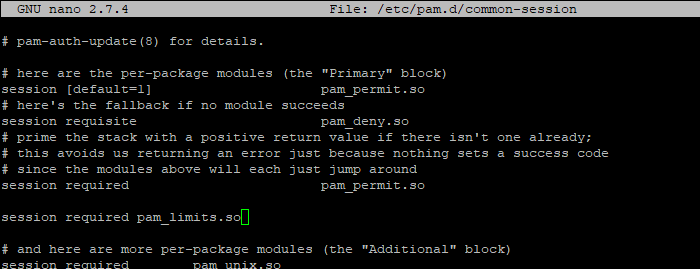
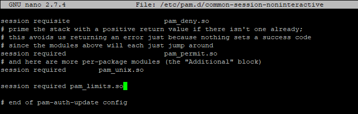

[ [Intro](README.md) ] -- [ [Preparations](aganode_10_preparations.md) ] -- [ **Raspberry Pi** ] -- [ [Bitcoin](aganode_30_bitcoin.md) ] -- [ [Lightning](aganode_40_lnd.md) ] -- [ [Mainnet](aganode_50_mainnet.md) ] -- [ [Bonus](aganode_60_bonus.md) ] -- [ [Troubleshooting](aganode_70_troubleshooting.md) ]

-------
### Beginner’s Guide to ️⚡Lightning️⚡ on a Raspberry Pi
--------

# ODROID-HC2

## Write down your passwords
You will need several passwords and I find it easiest to write them all down in the beginning, instead of bumping into them throughout the guide. They should be unique and very secure, at least 12 characters in length. Do **not use uncommon special characters**, spaces or quotes (‘ or “).
```
[ A ] root user password
[ B ] admin user password
[ C ] bitcoin user password
[ D ] Bitcoin RPC user and password
[ E ] LND wallet password
```

If you need inspiration for creating your passwords: the [xkcd: Password Strength](https://xkcd.com/936/) comic is funny and contains a lot of truth. Store a copy of your passwords somewhere safe (preferably in a password manager like [KeePass](https://keepass.info/)) and keep your original notes out of sight once your system is up and running.

## Preparing the operating system
The node runs headless, that means without keyboard or display, so the operating system Ubuntu Server is used. 

1. Download the [Ubuntu Minimal 18.04.1 LTS (v1.1)](https://wiki.odroid.com/odroid-xu4/os_images/linux/ubuntu_4.14/20181203-minimal) disk image
2. Write the disk image to your SD card using balenaEtcher

### Prepare Wifi 
I would not recommend it, but you can run your ODROID with a wireless network connection. To avoid using a network cable for the initial setup, you can pre-configure the wireless settings:

* Create a file `wpa_supplicant.conf` on the MicroSD card with the following content. Note that the network name (ssid) and password need to be in double-quotes (like `psk="password"`)  
```
country=[COUNTRY_CODE]
ctrl_interface=/var/run/wpa_supplicant GROUP=netdev
update_config=1
network={
    ssid="[WIFI_SSID]"
    psk="[WIFI_PASSWORD]"
}
```
* Replace `[COUNTRY_CODE]` with the [ISO2 code](https://www.iso.org/obp/ui/#search) of your country (eg. `US`)
* Replace `[WIFI_SSID]` and `[WIFI_PASSWORD]` with the credentials for your own WiFi.

### Start your ODROID
* Safely eject the sd card from your computer
* Insert the sd card into the ODROID
* If you did not already setup Wifi: connect the ODROID to your network with an ethernet cable
* Start the ODROID by connecting the power cable

## Connecting to the network
The ODROID is starting and getting a new address from your home network. This address can change over time. To make the Pi reachable from the internet, we assign it a fixed address.

### Accessing your router
The fixed address is configured in your network router: this can be the cable modem or the Wifi access point. So we first need to access the router. To find out its address, 

* start the Command Prompt on a computer that is connected to your home network (in Windows, click on the Start Menu and type cmd directly or in the search box, and hit Enter)
* enter the command `ipconfig` (or `ifconfig` on Mac / Linux)
* look for “Default Gateway” and note the address (eg. “192.168.0.1")

:point_right: additional information: [accessing your router](http://www.noip.com/support/knowledgebase/finding-your-default-gateway/).

Now open your web browser and access your router by entering the address, like a regular web address. You need so sign in, and now you can look up all network clients in your home network. One of these should be listed as “raspberrypi”, together with its address (eg. “192.168.0.240”).



:point_right: don’t know your router password? Try [routerpasswords.com](http://www.routerpasswords.com/).  
:warning: If your router still uses the initial password: change it!

### Setting a fixed address

We now need to set the fixed (static) IP address for the Pi. Normally, you can find this setting under “DHCP server”. The manual address should be the same as the current address, just change the last part to a lower number (e.g. 192.168.0.240 → 192.168.0.20).

:point_right: need additional information? Google “[your router brand] configure static dhcp ip address”

### Port Forwarding / UPnP
Next, “Port Forwarding” needs to be configured. Different applications use different network ports, and the router needs to know to which internal network device the traffic of a specific port has to be directed. The port forwarding needs to be set up as follows:

| Application name | External port | Internal port | Internal IP address | Protocol (TCP or UDP) |
| ---------------- | ------------- | ------------- | ------------------- | --------------------- |
| bitcoin          | 8333          | 8333          | 192.168.0.20        | BOTH                  |
| bitcoin test     | 18333         | 18333         | 192.168.0.20        | BOTH                  |

:point_right: additional information: [setting up port forwarding](https://www.noip.com/support/knowledgebase/general-port-forwarding-guide/).

The Lightning Network Daemon (LND) supports **UPnP** to configure the port-forwarding automatically and also advertise its own external IP address to the network. 

* Enable UPnP for your router.

:point_right: If you're not sure how, search ["enable upnp router MY-ROUTER-MODEL"](https://duckduckgo.com/?q=enable+upnp+router+MY-ROUTER-MODEL) for your own router model.

Save and apply these router settings, we will check them later. Disconnect the Pi from the power supply, wait a few seconds, and plug it in again. The node should now get the new fixed IP address.



## Working on the ODROID
### Introduction to the command line
We are going to work on the command line of the Pi, which may be new to you. Find some basic information below, it will help you navigate and interact with your Pi.

#### Entering commands
You enter commands and the Pi answers by printing the results below your command. To make it clear where a command begins, every command in this guide starts with the `$` sign. The system response is marked with the `>` character.

In the following example, just enter `ls -la` and press the enter/return key:
```
$ ls -la
> example system response
```


* **Auto-complete commands**: When you enter commands, you can use the `Tab` key for auto-completion, eg. for commands, directories or filenames.

* **Command history**: by pressing :arrow_up: and :arrow_down: on your keyboard, you can recall your previously entered commands.

* **Common Linux commands**: For a very selective reference list of Linux commands, please refer to the [FAQ](aganode_faq.md) page.

* **Use admin privileges**: Our regular user has no admin privileges. If a command needs to edit the system configuration, we need to use the `sudo` ("superuser do") command as prefix. Instead of editing a system file with `nano /etc/fstab`, we use `sudo nano /etc/fstab`.   
  For security reasons, the user "bitcoin" cannot use the `sudo` command.

* **Using the Nano text editor**: We use the Nano editor to create new text files or edit existing ones. It's not complicated, but to save and exit is not intuitive. 
  * Save: hit `Ctrl-O` (for Output), confirm the filename, and hit the `Enter` key
  * Exit: hit `Ctrl-X`

* **Copy / Paste**: If you are using Windows and the PuTTY SSH client, you can copy text from the shell by selecting it with your mouse (no need to click anything), and paste stuff at the cursor position with a right-click anywhere in the ssh window.

### Connecting to the ODROID
Now it’s time to connect to the ODROID via SSH and get to work. For that, a Secure Shell (SSH) client is needed. Install, start and connect:

- Windows: PuTTY ([Website](https://www.putty.org))
- Mac OS: built-in SSH client (see [this article](http://osxdaily.com/2017/04/28/howto-ssh-client-mac/))
- Linux: just use the native command, eg. `ssh pi@192.168.0.20`
- Use the following SSH connection settings: 
  - host name: the static address you set in the router, eg. `192.168.0.20`
  - port: `22`
  - username: `root` 
  - password:  `odroid`.



:point_right: additional information: [using SSH with ODROID](https://www.raspberrypi.org/documentation/remote-access/ssh/README.md)

### Raspi-Config
You are now on the command line of your own Bitcoin node. First we finish the Pi configuration. Enter the following command:  
`$ sudo raspi-config`

### Software update
It is important to keep the system up-to-date with security patches and application updates. The “Advanced Packaging Tool” (apt) makes this easy:  
`$ sudo apt-get update`  
`$ sudo apt-get upgrade`  

:point_right: Do this regularly every few months to get security related updates.

Make sure that all necessary software packages are installed:  
  `$ sudo apt-get install htop git curl bash-completion jq dphys-swapfile`

### Adding main user "admin"
This guide uses the main user "admin" instead of "pi" to make it more reusable with other platforms. 

* Create the new user, set password [A] and add it to the group "sudo"  
  `$ sudo adduser admin`  
  `$ sudo adduser admin sudo` 
* And while you’re at it, change the password of the “root” admin user to your password [A].  
  `$ sudo passwd root`
* Reboot and and log in with the new user "admin"  
  `$ sudo shutdown -r now`

### Adding the service user “bitcoin”
The bitcoin and lightning processes will run in the background (as a "daemon") and use the separate user “bitcoin” for security reasons. This user does not have admin rights and cannot change the system configuration.

* When using the command `sudo` , you will be prompted to enter your admin password from time to time for increased security. 
* Enter the following command, set your `password [A]` and confirm all questions with the enter/return key.  
  `$ sudo adduser bitcoin`

### Mounting external hard disk - THIS NEEDS MUCH TESTING
To store the blockchain, we need a lot of space. As a server installation, the Linux native file system Ext4 is the best choice for the external hard disk, so we will format the hard disk, erasing all previous data. The external hard disk is then attached to the file system and can be accessed as a regular folder (this is called “mounting”). 

:warning: **Previous data on this hard disk will be deleted!**

* Plug your hard disk into the running Pi and power the drive up. 

* Get the NAME for main partition on the external hard disk  
  `$ lsblk -o UUID,NAME,FSTYPE,SIZE,LABEL,MODEL` 

* Format the external hard disk with Ext4 (use [NAME] from above, e.g `/dev/sda1`)  
  `$ sudo mkfs.ext4 /dev/[NAME]`

* Copy the UUID that is provided as a result of this format command to your local (Windows) notepad. 

* Edit the fstab file and the following as a new line (replace `UUID=123456`) at the end  
  `$ sudo nano /etc/fstab`  
  `UUID=123456 /mnt/hdd ext4 noexec,defaults 0 0` 

* Create the directory to add the hard disk and set the correct owner  
  `$ sudo mkdir /mnt/hdd`

* Mount all drives and check the file system. Is “/mnt/hdd” listed?  
  `$ sudo mount -a`  
  `$ df /mnt/hdd`
```
Filesystem     1K-blocks  Used Available Use% Mounted on
/dev/sda1      479667880 73756 455158568   1% /mnt/hdd
```
*  Set the owner  
  `$ sudo chown -R bitcoin:bitcoin /mnt/hdd/`

* Switch to user "bitcoin", navigate to the hard disk and create the bitcoin directory.  
  `$ sudo su - bitcoin`  
  `$ cd /mnt/hdd`  
  `$ mkdir bitcoin`  
  `$ ls -la`

* Create a testfile in the new directory and delete it.  
  `$ touch bitcoin/test.file`  
  `$ rm bitcoin/test.file`

* Exit the "bitcoin" user session  
  `$ exit` 

If this command gives you an error, chances are that your external hard disk is mounted as “read only”. This must be fixed before proceeding. If you cannot fix it, consider reformatting the external hard disk.

👉 additional information: [external storage configuration](https://www.raspberrypi.org/documentation/configuration/external-storage.md)

### Moving the Swap File

The usage of a swap file can degrade your SD card very quickly. Therefore, we will move it to the external hard disk.  

* As user "admin", delete the old swap file  
  `$ sudo dphys-swapfile swapoff`  
  `$ sudo dphys-swapfile uninstall`  

* Edit the configuration file and replace existing entries with the ones below. Save and exit.  
  `$ sudo nano /etc/dphys-swapfile`

```
CONF_SWAPFILE=/mnt/hdd/swapfile

# comment or delete the CONF_SWAPSIZE line. It will then be created dynamically 
#CONF_SWAPSIZE=
```

* Manually create new swap file  
  `$ sudo dd if=/dev/zero of=/mnt/hdd/swapfile count=1000 bs=1MiB`  
  `$ sudo chmod 600 /mnt/hdd/swapfile`  
  `$ sudo mkswap /mnt/hdd/swapfile`  

* Enable new swap configuration  
  `$ sudo dphys-swapfile setup`  
  `$ sudo dphys-swapfile swapon`

## Hardening your Pi

The following steps need admin privileges and must be executed with the user "admin".

### Enabling the Uncomplicated Firewall
The Pi will be visible from the internet and therefore needs to be secured against attacks. A firewall controls what traffic is permitted and closes possible security holes.

The line `ufw allow from 192.168.0.0/24…` below assumes that the IP address of your Pi is something like `192.168.0.???`, the ??? being any number from 0 to 255. If your IP address is `12.34.56.78`, you must adapt this line to `ufw allow from 12.34.56.0/24…`.
```
$ sudo apt-get install ufw
$ sudo su
$ ufw default deny incoming
$ ufw default allow outgoing
$ ufw allow from 192.168.0.0/24 to any port 22 comment 'allow SSH from local LAN'
$ ufw allow proto udp from 192.168.0.0/24 port 1900 to any comment 'allow local LAN SSDP for UPnP discovery'
$ ufw allow 9735  comment 'allow Lightning'
$ ufw allow 8333  comment 'allow Bitcoin mainnet'
$ ufw allow 18333 comment 'allow Bitcoin testnet'
$ ufw enable
$ systemctl enable ufw
$ ufw status
$ exit
```


:point_right: additional information: [UFW Essentials](https://www.digitalocean.com/community/tutorials/ufw-essentials-common-firewall-rules-and-commands)

:point_right: If you find yourself locked out by mistake, you can connect keyboard and screen to your Pi to log in locally and fix these settings (especially for the SSH port 22).

### fail2ban
The SSH login to the Pi must be especially protected. The firewall blocks all login attempts from outside your network, but additional steps should be taken to prevent an attacker - maybe from inside your network - to just try out all possible passwords.

The first measure is to install “fail2ban”, a service that cuts off any system with five failed login attempts for ten minutes. This makes a brute-force attack unfeasible, as it would simply take too long.


*Me locking myself out by entering wrong passwords* :wink:

`$ sudo apt-get install fail2ban`

The initial configuration should be fine as it is enabled for SSH by default. If you want to dive deeper, you can  
:point_right: [customize the configuration](https://linode.com/docs/security/using-fail2ban-for-security/).

### Increase your open files limit

In case your RaspiBolt is swamped with internet requests (honest or malicious due to a DDoS attack), you will quickly encounter the `can't accept connection: too many open files` error. This is due to a limit on open files (representing individual tcp connections) that is set too low.

Edit the following three files, add the additional line(s) right before the end comment, save and exit.

```
$ sudo nano /etc/security/limits.conf
*    soft nofile 128000
*    hard nofile 128000
root soft nofile 128000
root hard nofile 128000


```




```
$ sudo nano /etc/pam.d/common-session
session required pam_limits.so
```




```
$ sudo nano /etc/pam.d/common-session-noninteractive
session required pam_limits.so
```




---

Next: [Bitcoin >>](aganode_30_bitcoin.md)
